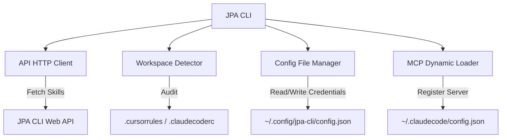

# JPA CLI - System Architecture

This document describes the technical architecture, component design, compilation, and file resolution strategies used in the JPA CLI utility.

---

## System Overview

The JPA CLI acts as a bridge between your local development workspace, AI coding agents (Claude Code, Cursor, Cline), and the JPA CLI central rules API.

---

## Key Components

### 1. Workspace Diagnostics Engine (`src/utils/detector.ts`)
- Scans current folders and parents to check if the project is under Git control.
- Audits the directory structures for specific config files (Cursor, Claude Code, GitHub Copilot).
- Checks build configurations (`package.json`, `Cargo.toml`, `composer.json`, `requirements.txt`, etc.) to heuristically detect language stacks (NodeJS, Python, Laravel, Rust, Go).

### 2. Secure Local Store (`src/utils/config.ts`)
- Manages reading and writing credentials to the local machine home directory.
- Encapsulates safe file operations, making sure directories are created if missing.
- Sets strict read/write mode configurations (`0o600`) to secure local API Keys on Unix/Linux platforms.

### 3. Dynamic MCP Loader (`src/utils/mcp.ts`)
- Reads the package's local `mcp/` assets directory.
- Due to standalone binary bundling via `pkg`, paths must be resolved differently at runtime:
  - If running via node, it locates `../../mcp`.
  - If running inside a `pkg` virtual executable snapshot (`process.pkg` is active), it maps to the embedded asset directory path `../mcp`.
- Decodes, parses, and validates `config.json` templates on demand (lazy loading) to avoid startup blocking on CLI executions.

### 4. CLI Routing & UI (`src/index.ts` & `src/commands/*`)
- Leverages `commander` for command-line parsing, options, and subcommands.
- Leverages `@clack/prompts` to create interactive CLI interfaces, multi-select menus, and animated spinners.

---

## Compilation & Packaging Pipeline

### 1. Bundling via ESBuild (`esbuild.config.js`)
- TypeScript source code is compiled and bundled into a single JavaScript file (`dist/index.js`).
- Uses CommonJS (CJS) targeting to ensure absolute compatibility with Node.js 18+ and `pkg` packing systems.

### 2. Cross-Compilation via `pkg`
- Compiles the single `dist/index.js` file along with the assets directories (`mcp/**/*` and `skills/**/*`) into a single executable binary.
- Outputs targeting configurations inside `package.json`:
  - `node18-linux-x64`
  - `node18-macos-x64`
  - `node18-macos-arm64`
  - `node18-win-x64`

---

## Testing Strategy (Vitest)

Unit tests are written using `vitest`.
- **API Tests (`src/utils/api.test.ts`)**: Mock API requests using axios mocks.
- **Config Tests (`src/utils/config.test.ts`)**: Verify reading/writing credentials and permission modifications.
- **Detector Tests (`src/utils/detector.test.ts`)**: Verify workspace environment identification.
- **MCP Tests (`src/utils/mcp.test.ts`)**: Mocks `fs` directory access and shell command execution to prevent side effects on development systems.
